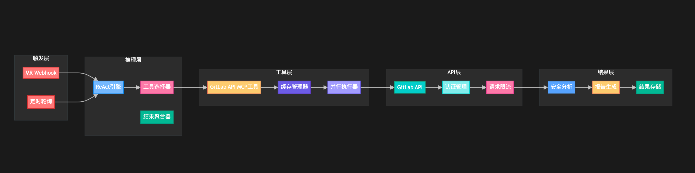
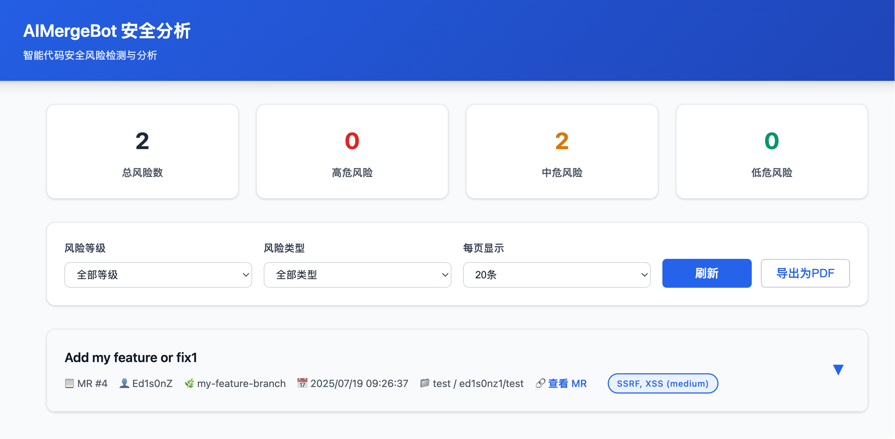
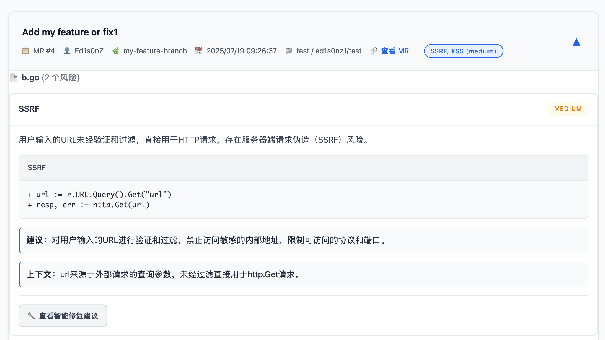
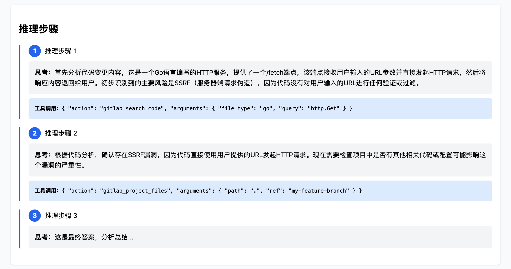

# AIMergeBot

> 🚀 自动化代码安全审查平台，支持 GitLab MR ，AI 智能检测 SQL注入、XSS、敏感信息泄露等风险，开箱即用！   
>[ bilibili视频介绍 - AIMergeBot](https://www.bilibili.com/video/BV1wpuozTETg/?vd_source=32c8f3da92120ecaedeefea506bf5be8)


## 实现原理
  

---

## 功能亮点
- **支持 GitLab Merge Request（MR）自动安全审查**
- **AI 智能检测**：SQL注入、XSS、CSRF、敏感信息泄露、SSRF、依赖风险等
- **结构化结果**：风险类型、等级、建议、上下文一目了然
- **智能修复建议**：提供完整的修复代码、修复说明、测试建议及注意事项
- **主动/被动双模式**：支持定时轮询和 Webhook
- **MR评论**：可自定义配置将扫描结果信息及建议以评论的方式，评论到对应MR
- **本地持久化**：已分析过的MR会记录在本地文件，系统重启不会重复分析
- **多项目支持**：配置灵活
- **ReAct + MCP**：更准确
- **导出结果**：支持导出PDF结果
- **一键部署，开箱即用**

---

## 快速开始

### 1. 克隆项目
```bash
git clone https://github.com/Ed1s0nZ/AIMergeBot.git
cd AIMergeBot
```

### 2. 安装依赖
```bash
go mod tidy
```

### 3. 配置 `config.yaml`
```yaml
# AIMergeBot 配置

# 监听端口，格式如 :8080
listen: ":8080"  # 监听的 HTTP 服务端口

gitlab:
  token: "xxxxxxxxxxxxxxxxxxxxx"  # GitLab 访问 Token，需有项目读权限
  url: "https://gitlab.com"           # GitLab 实例地址，支持自建/私有

openai:
  api_key: "sk-xxxxxxxxxxxxxxxxxxxxx"  # OpenAI 或兼容大模型 API Key
  url: "https://api.openai.com/v1"                                 # OpenAI API 地址，可自定义
  model: "gpt-4o-mini"                                           # 使用的大模型名称

projects:
  - id: 12345678           # GitLab 项目 ID（数字），可在项目设置页面底部查看
    name: "group/project" # GitLab 项目名称（group/project 格式），仅用于展示

# 是否启用主动轮询模式（定时扫描所有 MR）
enable_polling: true
# 是否启用 Webhook 模式（推荐，实时响应 MR 事件）
enable_webhook: true
# 是否自动在 MR 下添加安全审查评论
enable_mr_comment: true
# 是否全量扫描历史 MR（true=全量，false=只扫新/增量 MR）
scan_existing_mrs: true  # true=全量扫描，false=只扫增量MR
# 检测文件白名单，命中这些扩展名的文件将不进行检测
whitelist_extensions: ["txt", "md", "xlsx", "xls", "csv","zip"]
```
- `id` 为项目数字ID（见 GitLab 项目设置）
- `enable_polling` 主动轮询，`enable_webhook` 支持 Webhook

### 4. 运行服务
```bash
go run main.go
```

### 5. 配置 GitLab Webhook（可选）
- 在项目设置 Webhook，URL 填 `http://你的服务器:8080/webhook`
- 事件选择 Merge Request

### 6. 访问前端
浏览器打开 [http://localhost:8080/](http://localhost:8080/) 查看安全分析结果

---

## 界面预览
1. 展示界面：   
  

2. 详情界面：      
  

3. 评论界面：   
  
4. 推理界面：
  

---

## 常见问题 FAQ

**Q: 支持 GitHub PR 吗？**   
**A: 当前仅支持 GitLab MR，GitHub PR 暂不支持。**   

**Q: 支持哪些 AI 大模型？**   
A: 支持 OpenAI 兼容 API（gpt-3.5-turbo/gpt-4/moonshot/qwen/glm等），可自定义模型和API地址。   

**Q: 如何获取项目ID？**   
A: 见 GitLab 项目设置页面底部，或用 API 查询。   

**Q: 支持多项目吗？**   
A: 支持，`projects` 列表可配置多个项目。   

**Q: 支持自建/私有 GitLab 吗？**   
A: 支持，`gitlab.url` 填你的私有地址即可。   

**Q: 如何自定义分析频率？**   
A: 修改 `internal/gitlab.go` 里的 `time.Sleep` 参数。   


## 时间线
1. 2025.07.19
   - 优化界面展示；
   - 增加文件白名单，该名单内的文件都不进行扫描
2. 2025.07.20
   - 增加了按项目筛选的功能
3. 2025.08.03
   - 增加了ReAct模式，并完成了gitlab mcp开发和接入
     
