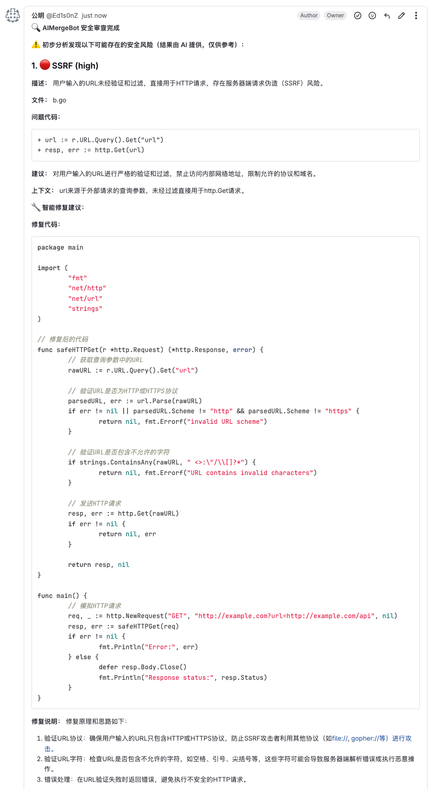

# AIMergeBot

> 🚀 自动化代码安全审查平台，支持 GitLab MR ，AI 智能检测 SQL注入、XSS、敏感信息泄露等风险，开箱即用！   
>[ bilibili视频介绍 - AIMergeBot](https://www.bilibili.com/video/BV1wpuozTETg/?vd_source=32c8f3da92120ecaedeefea506bf5be8)

## 实现原理
  

---

## 功能亮点
- **支持 GitLab Merge Request（MR）自动安全审查**
- **AI 智能检测**：SQL注入、XSS、CSRF、敏感信息泄露、SSRF、依赖风险等
- **结构化结果**：风险类型、等级、建议、上下文一目了然
- **智能修复建议**：提供完整的修复代码、修复说明、测试建议及注意事项
- **主动/被动双模式**：支持定时轮询和 Webhook
- **MR评论**：可自定义配置将扫描结果信息及建议以评论的方式，评论到对应MR
- **本地持久化**：已分析过的MR会记录在本地文件，系统重启不会重复分析
- **多项目支持**：配置灵活
- **ReAct + MCP**：更准确
- **导出结果**：支持导出PDF结果
- **一键部署，开箱即用**

---

## 核心特性

### 1. ReAct + MCP 增强架构
AIMergeBot 采用 ReAct（Reasoning and Acting）推理模式结合 MCP（Model Context Protocol）工具集，提供更精准的代码安全分析：

#### ReAct 推理模式
- **结构化推理**：每个分析步骤都包含思考、行动、观察的完整循环
- **深度分析**：通过多步骤推理深入理解代码逻辑和安全风险
- **智能决策**：基于上下文信息智能选择分析策略

#### MCP 工具集
- **10个核心工具**：覆盖代码安全审计的各个关键领域
- **专业化分工**：每个工具专注于特定安全领域
- **统一接口**：所有工具使用统一的 JSON 格式

### 2. 增强的 MCP 工具集

#### 已完全实现的核心工具（7个）

1. **gitlab_file_content** - 文件内容获取
   - 获取指定文件的完整内容
   - 支持分支和提交引用
   - 用于分析函数定义、变量声明等

2. **gitlab_file_info** - 文件信息获取
   - 获取文件的基本信息（行数、大小、类型等）
   - 帮助了解文件结构
   - 为后续分析提供上下文

3. **gitlab_search_code** - 代码搜索
   - 在仓库中搜索指定的文本或模式
   - 支持文件类型过滤
   - 用于查找相关函数调用、变量使用等

4. **gitlab_context_analysis** - 上下文分析
   - 分析代码片段的上下文关系
   - 智能行号调整和小文件优化
   - 提供前后代码、函数调用等信息

5. **gitlab_function_analysis** - 函数深度分析
   - 分析函数定义、调用关系、参数传递
   - 追踪函数调用链
   - 识别函数级别的安全风险

6. **gitlab_security_pattern_search** - 安全模式搜索
   - 支持 6 种常见漏洞模式
   - 可配置严重程度过滤
   - 提供具体的代码位置和上下文

7. **gitlab_dependency_analysis** - 依赖安全分析
   - 支持 Go、Node.js、Python 依赖
   - 识别依赖相关的安全风险
   - 提供版本安全检查


### 3. 智能工具调用改进

#### 智能行号调整
- 自动调整超出范围的行号到有效范围
- 提供详细的调整信息和建议
- 返回调整后的分析结果

#### 小文件优化
- 对于小文件（≤20行），自动返回完整内容
- 避免信息不足导致的误导
- 提高分析效率

#### 重试机制
- 自动重试网络错误、限流等临时性错误
- 递增延迟避免频繁请求
- 错误分类和友好提示

### 4. 统一架构优化

#### 统一智能修复建议流程
- ReAct模式和普通模式使用相同的修复建议生成逻辑
- 为所有问题生成具体的修复建议
- 统一错误处理和日志记录

#### 改进的评论功能
- 检测ReAct的整体建议
- 在评论开头显示ReAct智能分析的整体建议
- 避免重复显示上下文信息

---

## 快速开始

### 1. 克隆项目
```bash
git clone https://github.com/Ed1s0nZ/AIMergeBot.git
cd AIMergeBot
```

### 2. 安装依赖
```bash
go mod tidy
```

### 3. 配置 `config.yaml`
```yaml
# AIMergeBot 配置

# 监听端口，格式如 :8080
listen: ":8080"  # 监听的 HTTP 服务端口

gitlab:
  token: "xxxxxxxxxxxxxxxxxxxxx"  # GitLab 访问 Token，需有项目读权限
  url: "https://gitlab.com"           # GitLab 实例地址，支持自建/私有

openai:
  api_key: "sk-xxxxxxxxxxxxxxxxxxxxx"  # OpenAI 或兼容大模型 API Key
  url: "https://api.openai.com/v1"                                 # OpenAI API 地址，可自定义
  model: "gpt-4o-mini"                                           # 使用的大模型名称

projects:
  - id: 12345678           # GitLab 项目 ID（数字），可在项目设置页面底部查看
    name: "group/project" # GitLab 项目名称（group/project 格式），仅用于展示

# 是否启用主动轮询模式（定时扫描所有 MR）
enable_polling: true
# 是否启用 Webhook 模式（推荐，实时响应 MR 事件）
enable_webhook: true
# 是否自动在 MR 下添加安全审查评论
enable_mr_comment: true
# 是否全量扫描历史 MR（true=全量，false=只扫新/增量 MR）
scan_existing_mrs: true  # true=全量扫描，false=只扫增量MR
# 检测文件白名单，命中这些扩展名的文件将不进行检测
whitelist_extensions: ["txt", "md", "xlsx", "xls", "csv","zip"]

# ReAct + MCP 增强功能配置
react:
  enabled: true
  model: "gpt-4o-mini"
  temperature: 0.1
  max_retries: 3
  max_steps: 10

mcp:
  enabled: true
  verbose_logging: true
  gitlab:
    enabled: true
    retry_count: 2
    retry_delay: 1
```

### 4. 运行服务
```bash
go run main.go
```

### 5. 配置 GitLab Webhook（可选）
- 在项目设置 Webhook，URL 填 `http://你的服务器:8080/webhook`
- 事件选择 Merge Request

### 6. 访问前端
浏览器打开 [http://localhost:8080/](http://localhost:8080/) 查看安全分析结果

---

## 界面预览
1. 展示界面：   
  

2. 详情界面：      
  

3. 评论界面：   
  
4. 推理界面：
  

---

## 技术架构

### 文件结构
```
AIMergeBot/
├── internal/
│   ├── gitlab_mcp.go          # 核心 MCP 工具实现
│   ├── react_auditor.go       # ReAct 审计器
│   ├── gitlab.go              # GitLab 集成
│   ├── openai.go              # OpenAI 集成
│   ├── handler.go             # HTTP 处理器
│   ├── storage.go             # 数据存储
│   └── config.go              # 配置管理
├── web/
│   ├── index.html             # 前端界面
│   └── react_audit.html       # ReAct 分析界面
├── cmd/
│   └── test_tools/            # 测试工具
├── image/                     # 界面截图
├── main.go                    # 主程序入口
├── config.yaml                # 配置文件
└── README.md                  # 项目文档
```

### 核心特性

1. **避免误导**
   - 统一的 JSON 输出格式
   - 详细的上下文信息
   - 明确的风险等级和建议

2. **提高精准度**
   - 专业化工具分工
   - 多维度交叉验证
   - 结构化分析结果

3. **增强可操作性**
   - 精确的代码位置
   - 具体的修复建议
   - 清晰的风险评估

### 分层分析策略

1. **基础信息收集层**
   - `gitlab_file_info` → 了解文件结构
   - `gitlab_file_content` → 获取完整内容

2. **模式识别层**
   - `gitlab_security_pattern_search` → 搜索漏洞模式
   - `gitlab_search_code` → 搜索特定代码

3. **深度分析层**
   - `gitlab_function_analysis` → 分析关键函数
   - `gitlab_context_analysis` → 分析代码上下文

4. **专项审计层**
   - `gitlab_dependency_analysis` → 依赖安全检查
   - `gitlab_config_analysis` → 配置安全审查
   - `gitlab_api_endpoint_analysis` → API 安全审计

5. **风险追踪层**
   - `gitlab_data_flow_analysis` → 数据流追踪
   - `gitlab_error_handling_analysis` → 错误处理检查
   - `gitlab_authentication_analysis` → 认证机制分析

---

## 使用策略

### 工具组合示例

#### SSRF 漏洞分析流程
```json
1. gitlab_security_pattern_search → 搜索 SSRF 模式
2. gitlab_function_analysis → 分析相关函数
3. gitlab_data_flow_analysis → 追踪数据流
4. gitlab_context_analysis → 分析上下文
```

#### 依赖安全审计流程
```json
1. gitlab_dependency_analysis → 分析依赖
2. gitlab_config_analysis → 检查配置
3. gitlab_security_pattern_search → 搜索漏洞模式
```

### 预期效果

#### 精准度提升
1. **更全面的覆盖**
   - 从单一文件分析扩展到多维度审计
   - 覆盖代码、配置、依赖、API 等各个层面

2. **更深入的理解**
   - 从表面模式识别到深层逻辑分析
   - 支持函数级、数据流级、架构级的分析

3. **更准确的判断**
   - 从简单匹配到上下文感知分析
   - 多维度交叉验证降低误报率

#### 效率提升
1. **减少重复调用**
   - 每个工具都有明确的职责分工
   - 避免重复获取相同信息

2. **提高分析速度**
   - 并行处理多个维度
   - 智能缓存和优化

3. **降低误报率**
   - 多维度交叉验证
   - 上下文感知分析

#### 可操作性提升
1. **具体的位置**
   - 精确到行号的代码位置
   - 清晰的函数和变量追踪

2. **明确的建议**
   - 可操作的修复建议
   - 具体的代码示例

3. **风险分级**
   - 清晰的风险等级评估
   - 优先级排序建议

---

## 常见问题 FAQ

**Q: 支持 GitHub PR 吗？**   
**A: 当前仅支持 GitLab MR，GitHub PR 暂不支持。**   

**Q: 支持哪些 AI 大模型？**   
A: 支持 OpenAI 兼容 API（gpt-3.5-turbo/gpt-4/moonshot/qwen/glm等），可自定义模型和API地址。   

**Q: 如何获取项目ID？**   
A: 见 GitLab 项目设置页面底部，或用 API 查询。   

**Q: 支持多项目吗？**   
A: 支持，`projects` 列表可配置多个项目。   

**Q: 支持自建/私有 GitLab 吗？**   
A: 支持，`gitlab.url` 填你的私有地址即可。   

**Q: 如何自定义分析频率？**   
A: 修改 `internal/gitlab.go` 里的 `time.Sleep` 参数。   

**Q: ReAct 模式有什么优势？**   
A: ReAct 模式通过结构化推理和多步骤分析，能够更深入地理解代码逻辑，提供更准确的安全分析结果。   

**Q: MCP 工具集支持哪些编程语言？**   
A: 支持 Go、Node.js、Python、Java、PHP、Ruby、Rust 等多种编程语言。   

**Q: 如何调整 ReAct 分析深度？**   
A: 在配置文件中设置 `react.max_steps` 参数，控制推理步骤数量。   

---

## 时间线
1. 2025.07.19
   - 优化界面展示；
   - 增加文件白名单，该名单内的文件都不进行扫描
2. 2025.07.20
   - 增加了按项目筛选的功能
3. 2025.08.03
   - 增加了ReAct模式，并完成了gitlab mcp开发和接入
   - 新增10个核心MCP工具，覆盖代码安全审计的各个关键领域
   - 优化工具调用机制，解决行号超出范围等问题
   - 统一架构设计，提供更一致的用户体验

---

## 未来扩展

### 短期计划
1. **优化现有工具**
   - 提高分析精度和性能
   - 增强错误处理和重试机制
   - 支持更多编程语言和框架

2. **添加新的安全分析工具**
   - 根据实际需求开发新的分析工具
   - 添加更多安全模式和检测规则
   - 扩展支持更多编程语言

### 长期计划
1. **集成外部服务**
   - 漏洞数据库集成
   - 安全扫描工具集成
   - 威胁情报集成

2. **机器学习增强**
   - 模式学习
   - 风险预测
   - 自动修复建议

3. **扩展支持**
   - 更多编程语言
   - 更多框架支持
   - 更多安全标准

---

## 总结

通过这些 MCP 工具的增强，我们实现了：

1. **解决工具调用失败问题** - 智能行号调整和错误处理
2. **提高分析精准度** - 7个已实现工具的专业化分工
3. **增强可操作性** - 具体位置和明确建议
4. **避免误导** - 结构化输出和丰富上下文
5. **扩展性设计** - 7个已实现工具为未来扩展奠定基础

这些改进使得大模型能够：
- 更准确地识别安全漏洞
- 更深入地理解代码逻辑
- 更全面地评估安全风险
- 更有效地提供修复建议

通过分层分析策略和工具组合使用，我们建立了一个完整的代码安全审计体系，能够在不误导大模型的基础上显著提高分析的精准度和效率。
     
